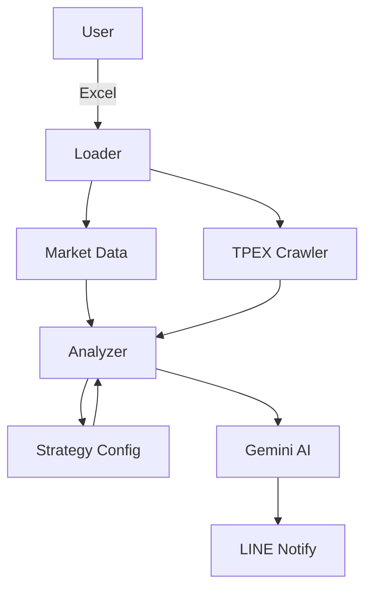

# System Architecture

## Overview
CBAS 採用分層式架構（Layered Architecture），將資料來源、核心策略、外部服務與使用者介面清楚分離，以確保：

- 策略邏輯可獨立演進
- 資料來源可替換
- AI 與通知服務可插拔

---

## High-Level Flow



---

## Layer Responsibilities

### Entry Layer
- **main.py**
  - 系統啟動入口
  - 串接各模組流程

### Config Layer (`config/`)
- 管理 `strategy_config.json`
- 所有策略參數集中管理
- 支援未來多策略切換

### Data Layer (`data/`)
- **loader.py**：Excel 清洗與欄位標準化
- **crawler.py**：櫃買中心上市日補抓（Selenium）
- **market_data.py**：Yahoo Finance 技術 / 基本面

### Core Layer (`core/`)
- **analyzer.py**：
  - R（Risk）風險評分
  - P（Potential）潛力評分
  - 合成總分並排序

### Service Layer (`services/`)
- **ai_agent.py**：
  - Gemini AI 串接
  - Retry + Exponential Backoff
- **notification.py**：
  - LINE 戰報推播

### UI Layer (`ui/`)
- **system_guide.py**：
  - 系統說明文件
  - 架構與流程視覺化

---

## R / P Model Concept

### R = Risk（越低越好）
- CB 市價風險
- 溢價率風險

### P = Potential（越高越好）
- 時機窗
- 籌碼面
- 價格位置
- 技術面
- 成交量

### Final Score

```
Total Score = P - R
```

此模型確保：
- 先排除「死掉的 CB」
- 再挑選「值得進攻的標的」

